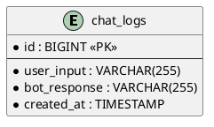

# チャットボットアプリ設計書

## 概要

名前を入力すると「Hello, ○○」と返信するシンプルなチャットボットアプリケーション。
ユーザーの入力はデータベースに記録される。

## 技術スタック

### フロントエンド
- Vue 3
- TypeScript
- Element Plus（UIライブラリ）
- Vite（ビルドツール）

### バックエンド
- Spring Boot 3.4
- Java 21
- H2 Database（組み込み）
- Spring Data JPA

## 機能要件

1. **チャット機能**
   - ユーザーが名前を入力
   - システムが「Hello, ○○」と返信

2. **データ記録機能**
   - ユーザーの入力をデータベースに保存
   - 入力日時も記録

## 画面設計

```
+------------------------------------------+
|           チャットボット                  |
+------------------------------------------+
|                                          |
|  +------------------------------------+  |
|  |  チャット履歴表示エリア            |  |
|  |                                    |  |
|  |  ユーザー: nakato                  |  |
|  |  ボット: Hello, nakato             |  |
|  |                                    |  |
|  +------------------------------------+  |
|                                          |
|  +----------------------------+ [送信]   |
|  | 名前を入力してください...  |          |
|  +----------------------------+          |
|                                          |
+------------------------------------------+
```

## API設計

### POST /api/chat

リクエスト:
```json
{
  "name": "nakato"
}
```

レスポンス:
```json
{
  "message": "Hello, nakato",
  "timestamp": "2026-02-04T09:17:00"
}
```

## データベース設計

### chat_logs テーブル

| カラム名 | 型 | 説明 |
|---------|-----|------|
| id | BIGINT | 主キー（自動採番） |
| user_input | VARCHAR(255) | ユーザーの入力 |
| bot_response | VARCHAR(255) | ボットの応答 |
| created_at | TIMESTAMP | 作成日時 |

## ER図



## ディレクトリ構成

```
devin-test-nakato/
├── design/
│   └── chatbot-design.md
├── frontend/
│   ├── src/
│   │   ├── App.vue
│   │   ├── main.ts
│   │   └── components/
│   │       └── ChatBot.vue
│   ├── index.html
│   ├── package.json
│   ├── tsconfig.json
│   └── vite.config.ts
├── backend/
│   ├── src/main/java/com/example/chatbot/
│   │   ├── ChatbotApplication.java
│   │   ├── controller/
│   │   │   └── ChatController.java
│   │   ├── service/
│   │   │   └── ChatService.java
│   │   ├── repository/
│   │   │   └── ChatLogRepository.java
│   │   ├── entity/
│   │   │   └── ChatLog.java
│   │   └── dto/
│   │       ├── ChatRequest.java
│   │       └── ChatResponse.java
│   ├── src/main/resources/
│   │   └── application.properties
│   └── pom.xml
└── README.md
```
